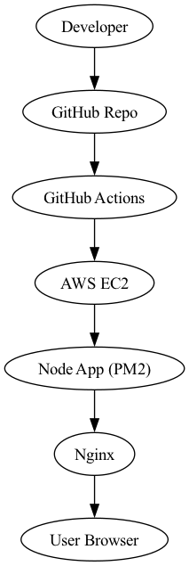

# AWS CI/CD Pipeline (CLI-Based)

## 🚀 Overview
This project implements a CI/CD pipeline using GitHub Actions and AWS EC2.

## 🧱 Architecture

## ⚙️ Tech Stack
- GitHub
- GitHub Actions
- AWS EC2 (Ubuntu)
- Node.js (Express)
- Nginx
- PM2

## 🔁 Deployment Flow
1. Developer pushes code
2. GitHub Actions triggers
3. SSH into EC2
4. Pull the latest code
5. Restart the application

## 🌐 Access
http://<EC2-PUBLIC-IP>